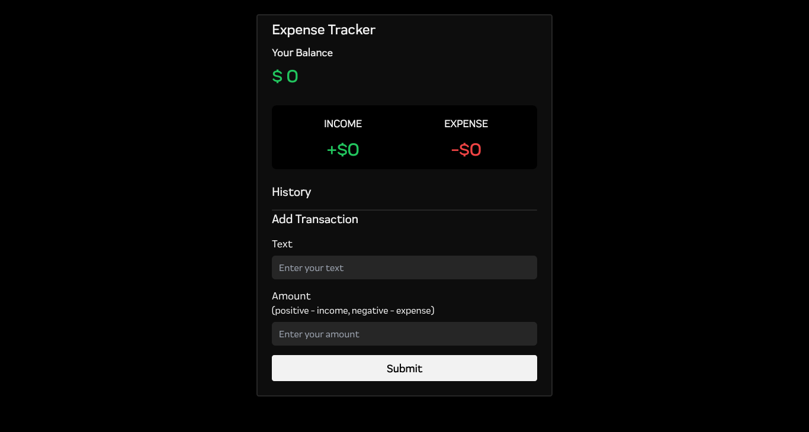

# Vue 3 Expense Tracker

An expense tracker app built with Bun 3 and the composition API.

- Add and remove expenses/income
- Track balance
- Save data to local storage



## Project Setup

```sh
bun install
```

## Compile and Hot-Reload for Development

```sh
bun run dev
```

## Compile and Minify for Production

```sh
bun run dev
```

### License MIT
